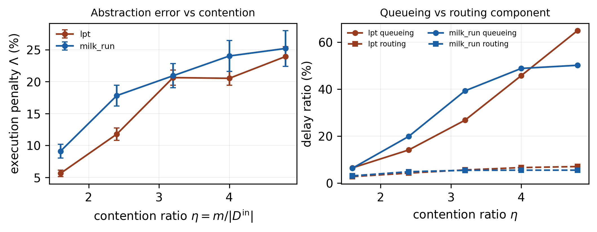
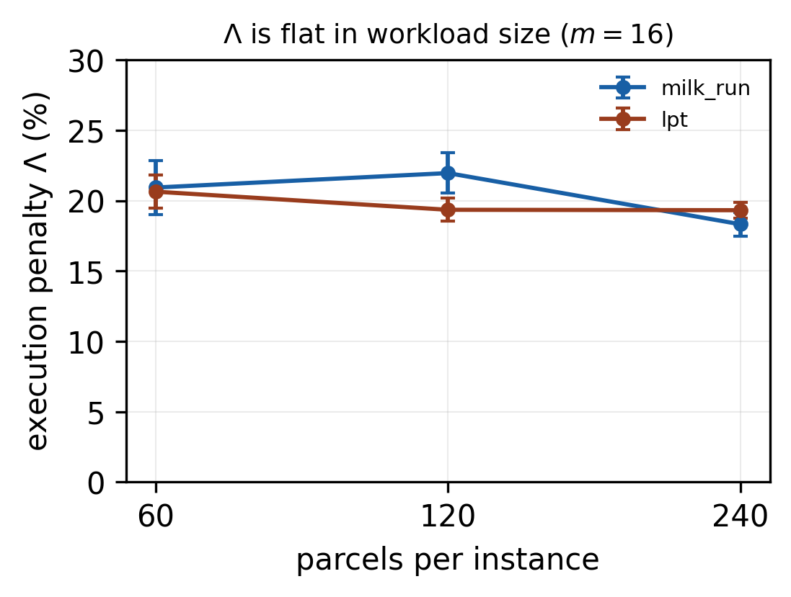

# Experiment 1 — results

**Final run, 2026-08-14, on the clean test set.** 8400 runs total:

- **Fleet curve** — `test_60.jsonl`, 100 instances × 60 parcels, 5 fleet sizes ×
  2 job rules × 6 AMR rules = 6000 runs → `raw/final_fleet_test60.jsonl`
- **Parcel-count check** — `test_120`/`test_240`, 100 instances each at m=16,
  2 job rules × 6 AMR rules = 1200 runs each

Method in `README.md`. Headline columns use `earliest_completion`.

> Supersedes an earlier 30-instance run kept in `raw/sweep.jsonl` (outputs under
> `curve.csv`, `summary.txt`, …). That run used `instances_60.jsonl`, all 30 of
> whose instances sit inside `train_60.jsonl`. No leakage — dispatching rules do
> not train — and the numbers barely moved (Λ at m=16 went 20.19 → 20.93). It is
> retained only for provenance; **cite the `final_`/`parcels_` outputs.**

---

## 1. Fleet curve, 100 clean instances

`milk_run + earliest_completion`

| m | η | idealised C̃ | executed C_max | Λ | Ω_q | Ω_r | queue share | clean |
|---|---|---|---|---|---|---|---|---|
| 8 | 1.6 | 403.7 | 439.9 | **9.11% ±1.06** | 6.3% | 3.0% | 68% | 100/100 |
| 12 | 2.4 | 308.1 | 362.3 | **17.82% ±1.63** | 19.8% | 4.8% | 81% | 100/100 |
| **16** | **3.2** | **290.4** | **350.6** | **20.93% ±1.90** | 39.2% | 5.4% | 88% | 100/100 |
| 20 | 4.0 | 283.6 | 350.2 | **24.03% ±2.43** | 48.8% | 5.4% | 90% | 100/100 |
| 24 | 4.8 | 281.4 | 349.9 | **25.21% ±2.80** | 50.1% | 5.4% | 90% | 100/100 |

`lpt + earliest_completion`

| m | η | idealised C̃ | executed C_max | Λ | Ω_q | Ω_r | queue share | clean |
|---|---|---|---|---|---|---|---|---|
| 8 | 1.6 | 568.1 | 599.9 | **5.63% ±0.51** | 6.4% | 2.7% | 70% | 100/100 |
| 12 | 2.4 | 397.7 | 443.9 | **11.78% ±0.97** | 14.1% | 4.2% | 77% | 100/100 |
| **16** | **3.2** | **316.5** | **381.2** | **20.64% ±1.18** | 26.7% | 5.5% | 83% | 100/100 |
| 20 | 4.0 | 296.2 | 357.0 | **20.53% ±1.06** | 45.7% | 6.5% | 88% | 100/100 |
| 24 | 4.8 | 284.6 | 351.9 | **23.95% ±1.54** | 64.9% | 7.0% | 90% | 100/100 |

## 2. Findings

### 2.1 Λ grows steeply, then keeps growing slowly — it does **not** saturate

**This retracts the saturation claim made from the 30-instance run.** At n=30 the
steps past η=3.2 were inside the noise and looked like a plateau. At n=100 the
CIs halve and most of those steps become significant:

| step | `milk_run` | `lpt` |
|---|---|---|
| 8 → 12 | **+8.72 ±1.86** | **+6.15 ±1.08** |
| 12 → 16 | **+3.10 ±1.77** | **+8.87 ±1.47** |
| 16 → 20 | **+3.11 ±1.95** | −0.12 ±1.39 |
| 20 → 24 | +1.18 ±1.51 | **+3.42 ±1.54** |

The defensible statement is: **Λ rises steeply to η ≈ 2.4–3.2 and then continues
to rise slowly but detectably; no plateau is reached within the tested range**
(η ≤ 4.8, the depot's capacity). Growth past the knee is roughly 1–3 pp per fleet
step versus 6–9 pp before it.

The two rules agree on the shape while differing in level and in exactly which
late step is significant, so the *form* of the curve is a property of the
facility, not of one heuristic — which answers `SCENARIO_SPEC_v3.md` known-gap
#2. `lpt`'s flat 16→20 followed by a significant 20→24 is not obviously
meaningful; the two rules disagree about which individual late step moves, which
is itself a reason to describe the tail as "slow growth" rather than to read
structure into any single step.

### 2.2 The queueing component dominates and grows

Queue share rises monotonically, 68% → 90% (`milk_run`) and 70% → 90% (`lpt`).
Ω_q rises steeply throughout (`lpt`: 6.4% → 64.9%) while Ω_r is nearly flat
(2.7% → 7.0%). **The dominant and fastest-growing component of the abstraction's
error is the one an assignment policy controls.** This is the paper's motivation
and it survives the larger sample intact — it is now the *strongest* claim in the
experiment, and the one to lead with.

Ω_q climbs far faster than Λ because Λ is a **makespan** ratio (a max over
robots) and Ω a **fleet-time** ratio (a sum). Past the knee the five doors bind,
so extra robots convert mostly into queueing time that does not lengthen the
critical path.

### 2.3 Λ is flat in workload size — not a startup artefact

At m=16, 100 instances per point:

| rule | n | parcels/robot | idealised | executed | Λ | queue share |
|---|---|---|---|---|---|---|
| `milk_run` | 60 | 3.75 | 290.4 | 350.6 | 20.93% ±1.90 | 88% |
| `milk_run` | 120 | 7.50 | 472.0 | 574.5 | 21.96% ±1.44 | 85% |
| `milk_run` | 240 | 15.00 | 859.0 | 1015.8 | 18.32% ±0.86 | 80% |
| `lpt` | 60 | 3.75 | 316.5 | 381.2 | 20.64% ±1.18 | 83% |
| `lpt` | 120 | 7.50 | 587.8 | 701.1 | 19.35% ±0.82 | 82% |
| `lpt` | 240 | 15.00 | 1134.2 | 1353.2 | 19.32% ±0.56 | 81% |

Every parcel releases at t=0, so at n=60 each robot handles only ~3.75 and a
large share of the makespan is the initial rush at the doors. **Λ nonetheless
holds at 18–22% across a fourfold increase in workload**, with `lpt` essentially
flat (20.6 → 19.4 → 19.3). Λ is therefore steady-state contention for the
service points, not a transient of the release structure — which closes the most
obvious objection to a t=0 release model.

The *composition* does drift: Ω_q falls with n (39.2% → 21.1% for `milk_run`) and
the queue share with it (88% → 80%), consistent with the startup rush being
amortised over more work. The headline penalty does not follow it down.

### 2.4 Rankings disagree; the cost is real but small

Kendall τ between the orderings induced by C̃ and by Φ over 12 rule combinations:

| m | η | τ | discordant / 66 | best by C̃ | best by Φ | regret |
|---|---|---|---|---|---|---|
| 8 | 1.6 | 0.785 | 7 | `milk_run+least_loaded` | `milk_run+earliest_available` | 0.03% ±0.39 |
| 12 | 2.4 | 0.785 | 7 | `milk_run+least_loaded` | `milk_run+earliest_available` | 0.09% ±0.41 |
| 16 | 3.2 | 0.723 | 9 | `milk_run+least_loaded` | `milk_run+earliest_available` | **0.44% ±0.40** |
| 20 | 4.0 | **0.385** | 20 | `lpt+least_loaded` | `lpt+earliest_available` | **1.37% ±0.70** |
| 24 | 4.8 | 0.600 | 13 | `lpt+least_loaded` | `lpt+earliest_available` | **1.30% ±0.67** |

The idealised model picks the executor's best combination at **none** of the five
fleet sizes, and disagreement worsens with contention (τ falls to 0.385 at
η=4.0). The pattern is systematic rather than noisy: C̃ always prefers
`least_loaded`, Φ always prefers `earliest_available`.

At n=100 the regret is now **statistically significant for m ≥ 16** — it was
inside the noise at n=30 — but it remains **practically small**, ≤ 1.4% of
executed makespan. So a large value error (≈21%) still coexists with a modest
decision error. Among dispatching rules the top of the ranking is a flat region;
mis-ordering it costs little.

**Do not lead the paper with ranking inversion.** The honest version is: the
abstraction misprices schedules badly and misranks them systematically, but among
*conservative rule-generated* schedules the misranking is cheap. The case for
executor-relative training rests on §2.2, and on the wider schedule distribution
a learned policy explores — the matrix-trained ablation, not this experiment.

### 2.5 Infeasibility: near-zero, and localised

**7 routing failures in 8400 runs (0.08%)** — not identically zero, as the
smaller run suggested. They are entirely concentrated:

| dataset | m | job rule | AMR rule | failures |
|---|---|---|---|---|
| n=60 | 20 | `lpt` | `material_match` | 1 |
| n=60 | 24 | `lpt` | `earliest_available` | 1 |
| n=60 | 24 | `lpt` | `least_loaded` | 1 |
| n=120 | 16 | `lpt` | `earliest_available`, `least_loaded` | 2 |
| n=240 | 16 | `lpt` | `earliest_available`, `least_loaded` | 2 |

Every failure is under `lpt` paired with an AMR rule that does not look ahead to
completion time. **Every headline column (both job rules × `earliest_completion`)
is 100/100 clean at every fleet size and every parcel count**, and `milk_run`
never fails at all.

This still cannot be used as an argument against dispatching rules — 0.08% is
negligible. It is reported as a control: it certifies that Λ measures congestion
rather than routing failure, and it justifies the analysis rule of excluding
`nu > 0` from timing means. See `README.md` §"On the infeasibility rate" for why
this project's non-zero infeasibility lives in the policy-rollout distribution
rather than here.

### 2.6 Extra robots stop paying, and C̃ overstates them throughout

Paired change in makespan (negative = improvement):

| rule | step | idealised says | executor delivers |
|---|---|---|---|
| `milk_run` | 8→12 | −23.49% ±1.18 | −17.50% ±1.23 |
| `milk_run` | 12→16 | −5.53% ±1.37 | −3.22% ±1.12 |
| `milk_run` | 16→20 | −2.15% ±1.49 | **−0.01% ±0.92** |
| `milk_run` | 20→24 | −0.79% ±0.95 | **−0.10% ±0.24** |
| `lpt` | 8→12 | −29.96% ±0.74 | −26.02% ±0.39 |
| `lpt` | 12→16 | −20.31% ±1.09 | −14.15% ±0.71 |
| `lpt` | 16→20 | −6.21% ±1.03 | −6.39% ±0.50 |
| `lpt` | 20→24 | −3.93% ±1.18 | **−1.46% ±0.50** |

C̃ overstates the return on fleet at almost every step. Under `milk_run` the
executor delivers **nothing** past m=16 (−0.01% and −0.10%, both CIs tight around
zero) while C̃ still promises gains. `lpt` keeps benefiting longer because its
single-trip pattern leaves the doors less saturated, but even there C̃ overstates
20→24 by nearly 3×.

## 3. What this means for the paper

1. **Lead with §2.2.** Λ ≈ 21% at the headline setting with 88% of it queueing,
   and the queue share rising monotonically to 90%. Robust, large, and pointed
   directly at what an assignment policy controls.
2. **§2.3 is the reviewer-proofing result.** Λ is flat across a 4× workload
   range, so the penalty is not an artefact of releasing every parcel at t=0.
3. **Drop the saturation language.** Λ keeps growing to the edge of the tested
   range. "Steep to the knee, slow growth after" is what the data supports.
4. **Do not lead with ranking inversion** (§2.4) — significant but ≤1.4%.
5. **Fleet sizing is a clean secondary result** (§2.6): past m=16 under
   `milk_run` the idealised model recommends robots that deliver nothing.

## 4. Limitations

1. Schedules come from dispatching rules only. Nothing here characterises a
   learned policy, and §2.4 in particular may look very different over the wider
   schedule distribution a policy explores.
2. **η is capped at 4.8 by the depot** (24 bays = 6 columns × 4 aisle rows).
   Because Λ has not plateaued at the top of the range, where it eventually
   levels off is unmeasured. Extending the sweep needs more bays.
3. The parcel-count check (§2.3) is at m=16 only. A full η sweep at n=240 would
   cost ≈9.3 h — the executor is roughly quadratic in parcel count (0.28 / 1.31 /
   5.6 s per run at n = 60 / 120 / 240).
4. `milk_run` uses `MILK_RUN_RADIUS = 3.0`, inside the [0,4] plateau where every
   value means "consolidate only at the door you are already at". Not retuned
   against executed makespan under the current geometry.
5. The uniform A/B/C mix is deliberately not the realistic 60/30/10 skew, which
   was measured to cut the penalty roughly threefold. Λ here is an upper bound
   relative to a small-parcel-heavy stream.
6. Single seed (42) for rule tie-breaking; one layout, one rack configuration.
7. `test_120`/`test_240` were regenerated at 100 instances on 2026-08-14 with
   seeds 20260814 / 20260815 (the original 50-instance files' seeds were not
   recorded). Seeds differ per file so the 240-parcel set is not a superset of
   the 120-parcel one; verified 0 shared 120-parcel prefixes.

## 5. Files

| file | contents |
|---|---|
| `run_final.sh` | the run that produced everything below |
| `analyze.py` | fleet curve, pairing, CIs, ranking, regret (`--raw`, `--prefix`) |
| `analyze_parcels.py` | the parcel-count check |
| `raw/final_fleet_test60.jsonl` | 6000 rows, fleet sweep |
| `raw/parcels_{120,240}_m16.jsonl` | 1200 rows each |
| `final_summary.txt`, `final_curve.csv`, `final_by_rule.csv` | fleet outputs |
| `final_marginal_fleet.csv`, `final_ranking_consistency.csv`, `final_selection_regret.csv` | §2.4, §2.6 |
| `parcels_summary.txt`, `parcels.csv` | §2.3 |
| `final_fig_penalty_curve.pdf`, `fig_parcel_scaling.pdf` | figures |
| `raw/sweep.jsonl` + unprefixed outputs | superseded 30-instance run, provenance only |
